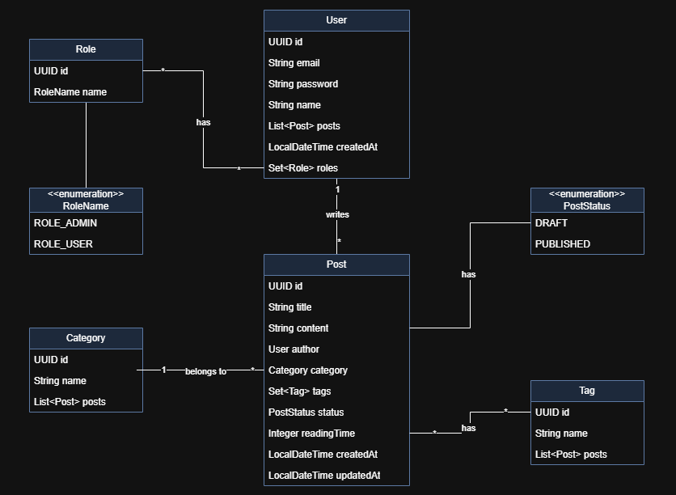

# 📘 Blog Platform API

Blog Platform API é uma API REST segura desenvolvida em Java com Spring Boot, criada como projeto prático para consolidar conhecimentos em autenticação e autorização utilizando tokens JWT. A aplicação permite que usuários se registrem, façam login e interajam com a plataforma conforme seus papéis (usuário comum ou administrador), acessando recursos conforme as permissões atribuídas. Os usuários autenticados podem criar e gerenciar posts, que são organizados por categorias e tags para facilitar a busca e navegação.

---

## 📦 Tecnologias

- Java 21+
- Spring Boot
- Spring Security
- Spring Data JPA
- Hibernate
- JWT (JSON Web Token)
- Jakarta Validation
- PostgreSQL (ou outro banco relacional)
- Lombok
- Maven

---

## 🔐 Segurança

A API utiliza:
- Autenticação baseada em **JWT (JSON Web Token)**
- Controle de acesso com **Spring Security**
- Perfis de usuário:
    - `ROLE_USER`: acesso padrão
    - `ROLE_ADMIN`: acesso completo a recursos restritos

---

## ✍️ Funcionalidades

- Registro e login de usuários
- Criação, atualização e exclusão de posts
- Associação de posts a **categorias únicas** e **múltiplas tags**
- Gestão de categorias, tags e roles (restrita a administradores)
- Validação com Bean Validation (Jakarta)
- Listagem e busca de posts com filtros de Specifications por:
  - Categoria
  - Tags
  - Data de criação

---

## 🧱 Arquitetura

A aplicação segue a **Arquitetura em Camadas** representando um **Diagrama de Classes**, com a seguinte estrutura:

- `controllers`, `services`, `mappers`, `domain`, `repositories`, `security`, `config`

---

